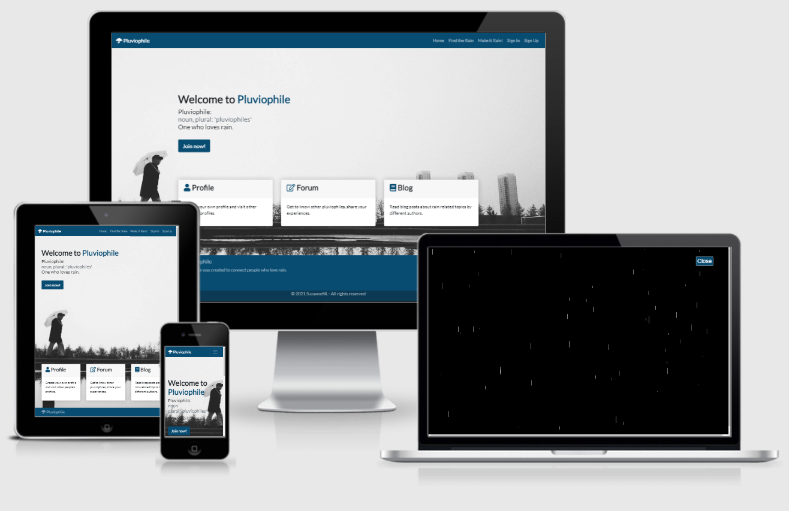

# PLUVIOPHILE
## Milestone project no.4
### Full Stack Frameworks with Django Milestone Project

#### Click [HERE](http://pluviophile.herokuapp.com/) for a link to the live website.
This website was created for educational purposes only.

## INTRODUCTION
### THE PROJECT
The origin of the word pluviophile can be found in the Latin word pluvio, which means rain, and -phila (Latin) or φίλος, phílos (Ancient Greek), which means dear or beloved. Therefore, Pluviophile means 'one who loves rain'. This project is a platform for people who love rain. 
Its main features are:
- A Django forum app
- A Django profiles app
- A Django blog app
- A Django donation app
- A JS weather app
- A JS rain animation<br>
Registered users can perform CRUD operations. CRUD stands for create, read, update and delete records. I will elaborate this later.
The Pluviophile website is a full stack project, and has been built using Python, Django, Javascript, jQuery, Bootstrap, CSS and HTML. 
The Pluviophole website can be viewed on pc monitors, laptops, tablets and mobile devices. It is hosted on Heroku. It uses Heroku Postgres as a database. Static files (incl. images) are hosted by the AWS S3 Bucket. 
The project can be viewed [HERE](http://pluviophile.herokuapp.com/).

### MY LEARNING PROCESS
Whereas I got most of the knowledge for my previous milestone projects from the Code Institute videos, I 'went rogue' for this project. I watched a number of YouTube tutorials that taught me about class based views, and read large parts of the Django documentation. This took a lot of time, even though I had a hard deadline for this project, but I learned very much from it. I really wanted to understand what I was doing. The turorials from CoreyMS and John Elder (see Sources) have taught me a lot.
I did need to follow along with Code Institute's Boutique Ado payment process videos. I'm very happy I chose a donation instead of an e-commerce payment process, because this forced me to understand what was happening in the Stripe videos and what each line of code was doing. I needed to understand everything, to be able to see what I needed for my donation process.
So I've learned a lot from this project, even though I would have loved to have had more time to spend on the frontend. My website doesn't look as nice as I would have liked, and there are still some bugs. But I feel a lot smarter than I did eight weeks ago and that's a win!

## Table of contents
- [**UX**](#UX)
    - [Goal/Strategy](#Goal/Strategy)
    - [Scope](#Scope)
    - [Structure](#Structure)
        - [Structure of the website](#Structure-of-the-website)
        - [Structure of the database](#Structure-of-the-database)
    - [Skeleton](#Skeleton)
    - [Target audiences](#Target-audiences)
    - [User Stories](#User-Stories)
    - [Design](#Design)
        - [Color choices](#Color-choices)
        - [Font families](#Font-families)
    - [Wireframes](#Wireframes)
- [**Features**](#Features)
    - [Existing features](#Existing-features)
    - [Features left to implement](#Features-left-to-implement)
- [**Technologies used**](#Technologies-used)
- [**Testing**](#Testing)
- [**Deployment**](#Deployment)
    - [Clone from GitHub](#Clone-from-github)
    - [Deployment to Heroku](#Deployment-to-Heroku)
    - [Setup with AWS S3 Bucket](#Setup-with-AWS-S3-Bucket)
    - [Send e-mails](#Send-e-mails)

- [**Credits**](#Credits)
    - [Media](#Media)
    - [Content](#Content)
    - [Sources](#Sources)
    - [Acknowledgements](#Acknowledgements)

## UX
### Goal/Strategy
The goal of this website is to connect people who love rain. It is a platform that people can join for free. It consists of different apps, and its registered users can perform different CRUD operations throughout the apps. Information is exchanged between the apps, making the website feel like a 'whole' instead of a website with separate sections. Donations are a way of supporting the website. The website is moderated by volunteers (currently only one), but monthly server costs do need to be covered.

### Scope
An easy to navigate and responsive website that is interactive and informative and allows users to perform CRUD operations.
The website consists of different apps that exchange information. 
Users can sign up. Their account page shows private information. Also, upon signing up, a profile page gets created, which users can personalize with a biography, date of birth, country and avatar. Other visitors can visit this profile, via the forum. 
In the forum app, logged in users can create, edit, delete and respond to rain related threads. They can edit and delete their comments. Their activity (the number of threads and comments they post) influences their status. The status is displayed as a number of drops. This activity information can also be seen on the profile page. 
In the blog app, logged in users can read blog posts, like them and bookmark them. Only superusers can upload, edit and delete blog posts. The bookmarked blog posts can be found on the account page.
In the donation app, users can donate 5 euros to support the platform. Details about donations can be found on the account page. A superuser can see information about all donations being made, by all users.

### Structure
#### Structure of the website
The website consists of a number of apps, each having its own templates. However, all pages share the same base (except for the rain animation). This base consists of a navigation bar, a section for messages, a content block and a footer. It also contains blocks for extra meta tags, css and javascript.
 
##### 1. Visible for all users:
- The home page, where users get an idea of what this website has to offer. It invites people to join the community. If a user is logged in, the join button has disappeared, but he sees buttons that redirect to the main parts of the website. 
- Find the rain, a modal where users can enter the name of a city and find out if it's raining there at that time. 
- Make it rain!, a rain animation built with Javascript. The animation can be opened at any time, and will redirect back to the previous page when it is closed. If a user comes from a different website, then after closing the rain animation, he will be redirected to the home page. 
##### 2. Visible for guest users:
- Sign up, where a user can sign up with an e-mail address, username and password. New users will receive an e-mail to confirm their registration. After that, they can log in. The sign up page can also redirect registered users to the sign in page.
- Sign in, where a user can sign in with his username and password. The page can also redirect new users to the sign up page.
##### 3. Visible for logged in users:
- Forum, which consist of a forum page, showing all threads with pagination, and thread pages, showing the thread and all its comments, also with pagination. There are pages for adding, editing and confirming deletion of threads and comments. Users can sort threads by date and title.
- Blog, which consists of a blog page, showing all blog posts with pagination, and blog post pages. Users can sort blog posts by date and title. The buttons and pages for adding, editing and deleting blog posts are only visible and accessible for superusers.
- Donate, which consists of a page that explains why the website needs donations, a charge page where a user can fill in Stripe's test card information, and a donation success page, which is where the user sees details from his donation after the donation (handled by Stripe) was successful. 
- Profiles, where one can learn more about a user. Users maintain their own profiles. They can write a biography, upload an avatar, and add a country and date of birth. It also shows activity details. Users can visit each other's profiles by clicking on names displayed on the forum. 
- Account, this is visible for the logged in user. Here he can see his personal information, bookmarks and donation details. He can also be redirected to a page for updating his password.
- Sign out, a user can click to sign out and then has to confirm that he wants to sign out. 

#### Structure of the database
In the development phase of the project, I used sqlite3 as a database. After deploying to Heroku, I used Heroku Postgres as a database, and stored my static files and images in the AWS S3 bucket.

I have imported the User model from django.contrib.auth.models (its fields are id, password, last_login, is_superuser, username, first_name, last_name, email, is_staff, is_active and date_joined).
The user model is the core of the project. It is connected to every other model. Either with a ForeignKey relationship (being the creator of blog posts/threads/comments/donations), or a OneToOne relationship (for the profile), or a ManyToMany relationship (for likes and bookmarks). 

Below you will find the custom models I have created. A side note: I'm not happy with my BlogPost model, which I will explain later.

Blog app - BlogPost model
**Database key**|**Field Type**|**Validation**
:-----|:----- |:-----
title | CharField | max_length=90
uploaded_by | ForeignKey (User) | on_delete=models.CASCADE
author | CharField | max_length=90, default="Author unknown"
body_part_1 | TextField |
body_part_2 | TextField | blank=True, default=''
body_part_3 | TextField | blank=True, default=''
image_1 | ImageField |
image_1_description | CharField | max_length=90, blank=True, default=''
image_2 | ImageField | blank=True
image_2_description | CharField | max_length=90, blank=True, default=''
image_3 | ImageField| blank=True
image_3_description | CharField | max_length=90, blank=True, default=''
date_created | DateTimeField | auto_now_add=True
likes | ManyToManyField (User) | related_name='blog_posts'
bookmarks | ManyToManyField (User) | related_name='blog_posts_bookmarks'

Donation app - Donation model
**Database key**|**Field Type**|**Validation**
:-----|:----- |:-----
donation_number | CharField | max_length=32, null=False, editable=False
donor | ForeignKey (User) | on_delete=models.CASCADE
donor_full_name | CharField | max_length=50, null=False, blank=False
email | EmailField | max_length=254, null=False, blank=False
date | DateTimeField | auto_now_add=True
stripe_pid | CharField | max_length=254, null=False, blank=False, default=''

Forum app - Thread model
**Database key**|**Field Type**|**Validation**
:-----|:----- |:-----
title | CharField | max_length=60
creator | ForeignKey (User) | on_delete=models.CASCADE
description | CharField | max_length=2000
date_created | DateTimeField | auto_now_add=True
date_edited | DateTimeField | auto_now=True

Forum app - Comment model
**Database key**|**Field Type**|**Validation**
:-----|:----- |:-----
thread | ForeignKey (Thread) | related_name="comments", on_delete=models.CASCADE
creator | ForeignKey (User) | on_delete=models.CASCADE
post | TextField | max_length=2000
date_created | DateTimeField | auto_now_add=True
date_edited | DateTimeField | auto_now=True

Profiles app - Profile model
**Database key**|**Field Type**|**Validation**
:-----|:----- |:-----
user | OneToOneField (User) | on_delete=models.CASCADE
biography | CharField | max_length=2000, blank=True, default=''
country | CountryField | blank=True, null=True, blank_label='(Select your country)')
date_of_birth | DateField | blank=True, null=True
member_since | DateTimeField | auto_now_add=True
slug | SlugField | max_length=300, unique=True, blank=True, null=True
avatar | ImageField | default='default-avatar.jpg'
 
### Skeleton
Wireframes were created using Balsamiq. Images of these wireframes are available under 'wireframes'. Responsiveness consists mostly of adapting the size of the background image and content to different sizes of screens. The design is fairly consistent throughout the website. 

### Target audiences
The website targets those who love rain. This means that people of all ages, nationalities and genders are welcome.

### User stories
#### As the creator of this website...
- I want my website to have a clear structure, so that it is easy to navigate.
- I want my website to give feedback to users, so that it is easy to navigate.
- I want my website to inform and entertain users with blog posts about rain.
- I want my website to connect members of the pluviophile community. 
- I want to let my registered users manage content they created themselves.
- I want to protect the work of users by not giving rights to edit and delete content or information of others. 
- I want to prevent guest users to upload content and also see content that is not meant for them. 
- I want to warn users when they try to delete their content, as a form of defensive programming. 
- I want superusers to have CRUD rights over all the content on this website, in case users behave in an unwanted fashion. 
- I want to be financially supported by members in the form of a voluntary donation. 

As a user in general...
- I enjoy the rain. 
- I enjoy reading about rain related topics. 
- I enjoy taking part in rain related conversations.
- I want to be able to easily navigate the website. 

As a guest user...
- I want to get an idea of what the website has to offer.
- I want to be able to sign up, so that I can get access to the blog, forum, profiles and donation pages.

As a logged in user...
- I want to read, like and bookmark blog posts.
- I want to be a part of the forum.
- I want to update my profile.
- I want to manage content that I have created.
- I can, for the most part, decide what information other users see about me.
- I want to see my private information details on my account page.
- I want to be able to update my password. 
- I want to have the possibility to make a donation.
- I want to be able to log out.

### Design
#### Color choices
The main color of the website is blue, as that is usually the color that people think of when they think of water. 
Bootstrap classes are used for several buttons and for toasts (success = green, error = red). 
The custom colors that I have chosen are:
-  #FAFAFA White
-  #000000 Black
-  #094C72 Dark Cerulean
-  #0C3953 Cyprus
-  #E0E1DD Snow drift
-  #F2F2F2 White smoke
-  #E31B23 Alizarin
-  #E6AE35 Tulip tree<br>
The background of many pages is a black and white image, of a man with an umbrella on a rainy day. At the end of this project, in the testing stage, when I tried out different devices, I discovered that the image and colors can appear to be quite dark. The Lenco screen I've used during development is quite bright. Had I had more time, then I would have experimented with the colors and perhaps a different background image, but I do not want to change it at this stage. Perhaps I will, after the assessment by CodeInstitute is finished. 

#### Font families
I used the following font-family:
- 'Lato' (sans-serif)

### Wireframes
Wireframes for this website were created using Balsamiq. You can find the wireframes in a PDF file [HERE](https://github.com/SuzanneNL/pluviophile/blob/master/documentation/wireframes/balsamiq-wireframes.pdf).
I didn't have much of a vision for the website, I was more focused on getting the backend to work. But I knew I wanted to use blue and I knew the layout, but I didn't have ideas for the background. 
I had created the wireframes for the most important pages and updated them from time to time, trying to see if the updated version would work better. In the end, I didn't change too much. And I then usually stuck to the wireframes.
However, I did not follow my wireframe for the homepage. I did not feel confident about the layout I had designed, which is also why I hadn't created a design for tablets and mobile devices. During development, it was empty for a long time. In the end, I chose a simpler layout, with three small cards and a definition. I then also chose a background, which is the image of the old man with an umbrella on a rainy day. I tried a fair amount of images, but not many were suited. A close up of drops, for example, was quite chaotic. I like the idea of the photograph that I'm using and how it's positioned on different devices, but I'm still disappointed that the colors turn out quite dark on certain devices. I would like to look into a new background image and choose different colors. But at this stage, right before submitting, I don't have any time left to experiment with this.

## FEATURES
### Existing features (per page)
#### Sign Up
- **Sign up functionality** - Signing up is very simple. The user has to fill in an e-mail address, a username and a password. E-mail address and password must be confirmed on the form. All fields have to meet certain requirements such as minimum and maximum length and the use of certain characters. Before this new account gets added to the database, Django first checks if the username and e-mail address already exist in the database. If not, the user will receive an e-mail with a link. He has to click this link and then confirm his registration. After that, he can login with his username and password.

#### Sign In
- **Sign in functionality** - After signing in with the username and password that were provided when signing up, the user is redirected to the home page. 

#### Sign Out
- **Sign out functionality** - When a user clicks on 'sign out' in the dropdown menu under his username in the navigation bar, he is redirected to a page that asks him to confirm his wish to sign out. After confirming, the user is redirected to the home page. 

#### Home
- **Content** - Users will get an idea of what the Pluviophile platform has to offer. Logged in users will see buttons to be redirected to the main parts of the website.

### Find the rain
- **Find the rain modal** - This is not a separate page, but a modal that can be opened from every page. It's available thanks to a context processor. A user can enter a city and sees if it's raining there at that moment.

#### Make It Rain
- **Rain animation** - Users see a Javascript rain animation. This covers the entire screen. If a user clicks on the close button, he is redirected to the previous page. But if a user came from another website, he is redirected to the home page. 

#### Forum
- **CRUD-functionality for threads** - Users can create new threads. The titles are then displayed on the forum page. Via the thread page, they can be redirected to the edit and delete thread pages. 
- **Threads** - On the forum page, users see a list of threads and some basic information about each thread, such as the creator , the date on which the thread was created, and how many comments a thread has. He also sees how many threads have been created in total. 
- **Sort option** - On the forum page, users can sort threads based on date (ascending and descending) and title (alphabetically, ascending and descending). By default, the user sees the most recent thread at the top of the page. 
- **Pagination** - The forum page is paginated per 5 threads. 
- **Visit profiles** - By clicking on a username, users get redirected to that user's profile page. 

#### Thread
- **CRUD-functionality for comments** - Users can write comments under the thread and its description. Users can be redirected to the edit and delete comment pages via the buttons under their comments. 
**Thread and comment details** - Users can see details for the thread and comments: who posted it, when it was posted (date and time), and if the thread or comment was edited and, if that is the case, when it was edited.
- **User details** - Next to the thread description and next to the comments, a bit of information is displayed about the user who has created that thread or posted that comment. It shows a username, a flag (if the user has selected his country on the profile page), an avatar, the date on which the user joined the website and a status, consisting of a number of drops. Superusers get 5 golden drops. Other users get 1, 2, 3, 4 or 5 blue drops, based on the number of threads and comments they have created/posted on the website. 
- **Visit profiles** - By clicking on a username next to a comment or the thread description, users get redirected to that user's profile page. 
- **Pagination** - Each thread page is paginated per 5 comments. 

#### Blog
- **List of blog post** - Users see a list of blog posts. They see the first image (which is required), the title, the author and the date and time a blog post was created. They also see the first 30 words as a preview, to make a user curious about the rest of the blog post. Clicking on the image or the 'read blog post' button redirects the user to the blog post page. 
- **CRUD-functionality for blog posts** - Superusers can add blog posts via the button at the top of the blog posts list. Superusers can be redirected to the edit and delete blog post pages via the buttons at the bottom of a blog post. 
- **Sort option** - On the blog page, users can sort blog posts based on date (ascending and descending). By default, the user sees the most recent blog post at the top of the page. 
- **Pagination** - The blog is paginated per 4 blog posts. 

#### Blog Post
- **Blog post** - Obviously, users see the blog post and all its details and images and image descriptions. If the user is a superuser, he sees buttons to be redirected to pages for editing and deleting the blog post.  
- **Bookmark functionality** - Users can bookmark a blog post. This makes the bookmark icon blue. Users can find all their bookmarks on their account page. He can remove bookmarks at any time by clicking the bookmark icon again. It will then turn white again.
- **Like functionality** - Users can like a blog post. This makes the heart icon red. He can unlike the blog post at any by clicking the heart icon again. It will then turn white again. Next to the heart icon, a user also sees how many users have liked this blog post, and he can click on 'Show likes' to see who liked the blog post. He can hide the likes by clicking 'Hide likes'.

#### Donation & Charge (with Stripe)
- **Information about donating** - Users can read why the website would like to receive donations. Clicking on the make donation button, redirects them to the next page.
- **Payment** - When a user opens this page, a payment intent for € 5,- is created and gets sent to Stripe. When a user fills out the form correctly and clicks the Donate button, the payment gets processed. A webhook is in place to make sure the donation gets created in the database and processed, if something goes wrong (like the browser gets closed too early). At this moment, it doesn't handle real payments, but it handles payments with Stripe's test payment details. 
- **Loading animation** - A loading animation is shown while the payment is processed.

#### Donation success 
- **Donation details** - When the donation is processed correctly, the user gets redirected to the success page, where he can find details about the donation he's just made, like the donation number. 
- **Confirmation e-mail** - Users also receive a thank you e-mail with donation details, that informs them that the donation was successfully processed. 

#### Profile
- **CRUD-functionality for personal information** - Users can visit each other's profiles, and at first, there is no other information except for the default avatar and the activity details. A user can add a biography, select the country where he's from and add his date of birth. If the user has added a country, then a flag of that country will appear next to his username both on the profile page and on thread pages next to posts made by the user. He can edit his profile by clicking on the edit profile button. 
- **Avatar** - A default image is used when a user signs up and the profile page gets created. He can edit this avatar by uploading an image on the edit profile page. 
- **Activity details and 'drop' status** - Users see the date on which a user joined the website and when he was last online. They also see the number of threads and comments a user has created/posted on the website. These numbers are also used to create an activity status. This status is displayed by of a number of drops. Users get 1, 2, 3, 4 or 5 blue drops. The more posts they make, the more drops they get. Except for superusers. Superusers always get 5 golden drops.  

#### Account
- **Account information** - On the account page, the user sees this account details and a button to be redirected to a page where he can update his password. This is handled by Django allauth. 
- **Bookmarks** - He also sees his bookmarks, if he has any. He can go to the blog post by clicking on it. 
- **Donations table** - If the user has donated to Pluviophile, a donation table gets created. For each donation, a row is added, showing exactly when the donation was made, which details the user gave (name, e-mail address), the amount (always € 5,-) and the donation number. At the top of the table, he sees the total amount he has donated. Superusers will see this information for themselves, but they will also see a table with all the donations, made by all users. They also see the total amount users have donated. 

#### Error Pages
- When a user tries to access a page that he's not allowed to access, the user gets redirected or is shown an error page, that redirects him to the home page. 
- When an error occurs (for 404 and 500 errors), users get redirected to an error page with a button to go back to the home page. 

#### Several Pages
- **Back to top button** - Pages that can get quite long, like on the forum and blog, have a back to top button that appears when a user scrolls down. Clicking on this scrolls the page back to the top.
- **Feedback from forms** - Forms give feedback when a field isn't filled in according to the requirements. For example, when a user enters a username that's too short, or a faulty e-mail address (without a e-mail formatting), or when a user leaves a field blank when it's a required field. In all these cases, forms will not be submitted, but the user will see feedback under the form field.
- **Icons** - Icons are used throughout the website to make it more visually appealing and to simplify navigation.

#### All Pages (Rain Animation excluded) 
- **Django messages (toasts)** - Messages give feedback to the user about his activity and appear at the top right of the page, under the navigation bar. They appear after actions such as signing up, logging in or CRUD actions. 
- **Responsive navigation bar** - The navigation bar is visible on all pages and fixed to the top, so it stays visible as the user scrolls down. It redirects users to different parts of the website. The items in the navigation bar vary though, based on whether a user is logged in or not. As a guest user, one sees Home, Find the rain, Make it rain!, Sign in and Sign up. 
Once signed in, the options Sign Up and Sign In have disappeared. Instead, users see Forum, Blog and Donate. They also see their own username with their avatar next to it. Clicking on the username opens a dropdown menu, that shows options to be redirected to the Profile and Account page or to sign out. 
- **Footer** - The footer sticks to the bottom of the page and allows users to redirect to (social) media pages. 

### Features left to implement
A number of the features left to implement, have unfortunately been left out due to the fact that I was working with a deadline. Others require me to learn more about Django. 
- **Comments under blog posts** - I initially planned on adding this feature. I have already shown however, that I know how to connect comments to a thread on the forum. I could use the same technique to add comments to a blog post, which would be even more simple. But since I'm working with a deadline and already showed how I could do this, I left it out for now. 
- **SLUG for forum and blog** - I have shown that I can implement slug fields for the profile pages. If I had time, I would have also added slugs for the forum and blog posts. 
- **Choose donation amount** - Currently, users can only donate € 5,- per donation. I would like to give users the option to either select an amount (for example with buttons for 2, 5 and 10 euros), or let them type the amount themselves. But I chose to focus on getting the payment and webhooks in order, which took a lot of time to get working. I therefore didn't work out the 'select amount' option yet. 
- **Share on social media** - This would allow a user to share a blog post on his personal social media page. It would give publicity to both my website and the authors.  
- **Search functionality** - This could be added to both the forum and the blog app.
- **Quote comments (comment in comment)** - On a forum, users can usually respond specifically to someone else's comment. The original comment is then displayed between quotation marks, and the new user's comment is underneath, all inside one comment div. I would like to have this functionality on my forum. 
- **Widget for images** - like in the Boutique Ado project, this would be more user friendly.
- **DM's between users** - I would like to implement direct message functionality, where users can send private messages to each other. 
- **Rich text editor** - The steps a superuser has to follow in order to upload a blog post are not very user friendly for several reasons, for example:
	- It is not immediately clear how the user can upload the blog post, there are instructions to read first. I can only hope that he does.
	- He has to cut his text into different parts.
	- He is limited to three images.
	- He is encouraged to limit his use of html, and has to know some html in order to use html tags properly.<br>

I have looked into using a rich text editor, I know that there are several and I even installed one in my back up project (ckeditor). I saw a lot of advantages:
	- The text editor uses icons and looks a bit like a Word text editor, so it's easier to use without reading instructions.
	- There is no need to know html.
	- There is no limit on how many images can be used, or where and how they're positioned in the text.
	- I can simplify my model by removing the fields for second and third body/image/description.

Had my goal been to allow every user to write blog posts and for his own audience, then I would have given my users the ease and freedom that comes with a rich text editor.
But I wanted this website to have a consistent design. Only superusers are allowed to upload blog posts, and they can be schooled in basic html. And currently, there's just me. Also, I want images to be stored in my database, instead of relying on URL's of other websites. On top of that, I had limited time for this project and wasn't sure if I was able to resize the text editor for mobile screens. 
Therefore this is not so much an unresolved issue, it's more me making a decision after considering the options. I might change my mind later in time though, and switch to the rich text editor because I still think it is more user friendly.

(Comment added not too long before submission: As I was filling my Postgres database with blog posts, I realized that I can still add images to a textarea because it processes html. I've done that for one of the blog posts. I even added YouTube videos. I'm not going to remove the image and blog fields at this moment, but I probably will, after the project has been assessed.)
- **Separate admin page** - It might be nice to have a separate admin page where all the donation information can be found (instead of on the account page), and also where he can maybe delete users. This last thing has to be done on the admin panel for now. 

## TECHNOLOGIES USED
- [HTML](https://developer.mozilla.org/en-US/docs/Web/HTML) - for the structure of the website.

- [CSS](https://developer.mozilla.org/en-US/docs/Web/CSS) - adds style to the website.

- [Javascript](https://developer.mozilla.org/en-US/docs/Web/Javascript) - an application controller/for interactive effects.

- [jQuery](https://jquery.com/) - a JavaScript library.

- [Bootstrap](https://getbootstrap.com/) - makes the website responsive. 

- [Python](https://www.python.org/) - the backend programming language. 

- [Django](https://docs.djangoproject.com/en/3.2/) - Python web framework.

- [PIP](https://pypi.org/project/pip/) - Python package installer.

- [Django Allauth](https://django-allauth.readthedocs.io/) - for authentication, registration and account management.

- [Django Countries](https://pypi.org/project/django-countries/) - Django application that provides country choices.

- [Django Crispy Forms](https://django-crispy-forms.readthedocs.io/) - for rendering Django forms.

- [Django Sortable Listview](https://pypi.org/project/django-sortable-listview/) - for sorting and pagination of Django ListViews.

- [Pillow](https://pypi.org/project/Pillow/2.2.1/) - Python imaging library.

- [Stripe](https://www.stripe.com) - for payment processing.

- [Git](https://git-scm.com/) - for Version Control.

- [GitHub](https://github.com/) - where the repository is hosted.

- [Heroku](https://www.heroku.com/) - where the live website is hosted.

- [Heroko Postgres]( https://www.heroku.com/postgres) - database for hosted website.

- [AWS S3 bucket]( https://aws.amazon.com/s3/) - for storing static files, including images.

- [Google Chrome](https://www.google.com/chrome/) - used for Chrome DevTools and as a browser.

- [Google Fonts](https://fonts.google.com/) - for font-families. 

- [Autoprefixer CSS online](https://autoprefixer.github.io/) - to prefix my CSS.

- [Font Awesome](https://fontawesome.com/) - for icons.

- [Balsamiq](https://www.balsamiq.com/) - for wireframes. 

- [Am I Responsive](http://ami.responsivedesign.is/) - to test the responsiveness of the website.

## TESTING
The testing process can be found in this separate document [HERE](
https://github.com/SuzanneNL/pluviophile/blob/master/testing.md).

## DEPLOYMENT
### Clone from GitHub:
To run the application locally, you can follow these steps: 
1. Go to the repository [SuzanneNL/pluviphole](https://github.com/SuzanneNL/pluviophile).
2. Click on 'code' (next to the green gitpod button). In the dropdown menu, copy the clone link, which is ```https://github.com/SuzanneNL/pluviophile.git.```
3. Open your working directory. In the terminal, clone the repository using the clone link, by running the following command:
```
git clone https://github.com/SuzanneNL/pluviophile.git
```
4. Access the folder and install all required modules with the following command:
```
pip3 install -r requirements.txt
```
5. Create the `env.py` file (at the root level) for environment variables, and add the following:
```
import os

os.environ["SECRET_KEY"] = '<Your Django Secret Key>'
os.environ["STRIPE_PUBLIC_KEY"] = '<Your Stripe Public Key>'
os.environ["STRIPE_SECRET_KEY"] = '<Your Stripe Secret Key>'
os.environ["STRIPE_WH_SECRET"] = '<Your Stripe Webhook Secret>' 
os.environ["OPEN_WEATHER_MAP_KEY"] = '<Your Open Weather Map Key>' 
os.environ["DEVELOPMENT"] = '1'
```
Make sure to fill in your own values!<br>
6. In settings.py add:
```
if os.path.exists("env.py"):
    import env
```
and
```
DEBUG = 'DEVELOPMENT' in os.environ
```
7. Add your env.py file to `.gitignore`, before pushing your changes.<br>
8. Create a migrations file and migrate the models to the database by running the following commands:
```
python3 manage.py makemigrations
python3 manage.py migrate
```
9. Create a superuser by running the following command:
```
python3 manage.py createsuperuser
```
Follow the required steps. This superuser can access the admin panel. In this panel, content can be easily added to the database. You would be using the sqlite3 database from Django at this point.<br>
10. To run the application locally, run the following command:
```
python3 manage.py runserver
```
And open the browser. 

### Deployment to Heroku
Steps to deploy this project to Heroku are as follows:
1. Go to [Heroku](https://www.heroku.com/) and create a new app.
2. Go to 'Resources'. Under 'add-ons', select 'Heroku Postgres' and then select a plan. You can choose the Hobby Dev plan.
3. In your terminal, install psycopg2-binary and the dj-database-url package with the following commands:
```
pip3 install dj-database-url
pip3 install psycopg2-binary
```
4. Add psycopg2-binary and dj-database-url to your requirements.txt file, with the following command:
```
pip3 freeze > requirements.txt
```
5. Import dj_database_url in settings.py, under 'import os' like so:
```
import dj_database_url
```
6. In the databases settings, comment out the default configuration, and replace the default database with a call to dj_database_url.parse:
```
DATABASES = {
    'default': dj_database_url.parse(<Database_URL from Heroku>)
}
```
You can find the database URL on Heroku under 'Config Vars' in your 'settings' tab. Warning: do not commit these changes with the database URL in your settings.py!
7. Run migrations with the following command:
```
python3 manage.py migrate
```
8. Create a superuser with the following command:
```
python3 manage.py createsuperuser
```
And fill in the required information. 
9. In settings.py, use an if statement so that when the app runs on Heroku, you will connect to Postgres, and otherwise, it will connect to sqlite3, like so:
```
if 'DATABASE_URL' in os.environ:
    DATABASES = {
        'default': dj_database_url.parse(os.environ.get('DATABASE_URL'))
    }
else:
    DATABASES = {
        'default': {
            'ENGINE': 'django.db.backends.sqlite3',
            'NAME': BASE_DIR / 'db.sqlite3',
        }
    }
```
10. Install gunicorn and freeze that to the requirements file with the following commands:
```
pip3 install gunicorn
pip3 freeze > requirements.txt
```
11. Create a Procfile and inside, add the following:
```
web: gunicorn pluviophile.wsgi:application
```
12. Login to Heroku in the CLI and temporarity disable collectstatic, with the following command:
```
heroku config:set DISABLE_COLLECTSTATIC=1 --app pluviophile
```
13. Add your Heroku app and local host to allowed hosts in settings.py.
14. Push to Github, and then to Heroku master. 
15. Back on Heroku, go to the 'Deploy' tab. In the section 'Deployment Method' click on 'Github - Connect to Github'. Make sure your Github profile is displayed. Add the repository name and click on 'Search'. After Heroku has found the repository, click on 'Connect'. This will connect your Heroku app to your GitHub repository. Click 'Enable automatic deploys'. Your code will automatically be deployed to Heroku as well. 
16. Go to the 'Settings' tab. In the section 'Config Vars' enter the following values:

 **Key**|**Value**|
:-----|:-----
SECRET_KEY| Your Django Secret Key, as written in the env.py file
STRIPE_PUBLIC_KEY| Your Stripe Public Key, as written in the env.py file
STRIPE_SECRET_KEY| Your Stripe Secret Key, as written in the env.py file
STRIPE_WH_SECRET| Your Stripe Webhook Secret, as written in the env.py file
OPEN_WEATHER_MAP_KEY | Your Open Weather Map Key, as written in the env.py file

You can now open and view the app. You can log into the admin panel and add some data to the database. There will be no static files or images yet.

### Setup with AWS S3 Bucket
1. Create an account with [AWS](www.aws.amazon.com), follow the steps and sign in. 
2. Go to the AWS management console and go to the S3 service. There, create a new bucket. Uncheck 'block all public access' and acknowledge that the bucket will be public.
3. Go to the buckets properties, and turn on static website hosting. Select 'Use this bucket to host a website', and fill in index.html and error.html, then click 'save'.
4. Go to the permissions tab, and go to CORS configuration. Paste in a CORS configuration:
```
[
  {
      "AllowedHeaders": [
          "Authorization"
      ],
      "AllowedMethods": [
          "GET"
      ],
      "AllowedOrigins": [
          "*"
      ],
      "ExposeHeaders": []
  }
]
```
5. Go to the Bucket policy tab and click 'policy generator', to create a policy. Choose 's3 bucket policy', allow all principals by typing a star. From the action dropdown menu select 'GetObject'. Copy the ARN and paste it into the ARN box. Then click 'add statment' and then click 'generate policy'. Copy the policy into the bucket policy editor. Add a slash star onto the end of the resource key. Click 'save'. 
6. Go to access control list tab, under public access, click on 'Everyone', select 'List Objects'. Then click 'save'. 
7. Go to IAM (from services menu), click on 'groups' and create a new user group. Give the group a group name (f.e. 'manage-pluviophile'). Then click 'create group'. 
8. Click 'policies' in the dashboard, and then click 'create policy'. Go to the JSON tab. Click 'import managed policy'. Import 'AmazonS3FullAccess'. Get the bucket ARN from the bucket policy page in S3, and paste that in after 'Resource', as a list (first the ARN, then also the ARN with a slash and star). Click 'next tags' and then 'next review'. Give it a name and description. Click 'create policy'. 
9. Go to 'groups'. Click the manage-pluviophile group. Go to 'permissions'. Click 'attach policy'. Select the policy you just created. Click 'add permissions' and then 'Attach policy'.
10. Go to 'users'. Click 'add user'. As username write 'pluviophile-staticfiles-user. Give programmatic access. Click 'next'. Add the user to the group. Click through to the end. Download the .csv file. 
11. Go back to GitPod. Install boto3 and Django storages, and freeze them to the requirement file with the following commands:
```
pip3 install boto3
pip3 install django-storages
pip3 freeze > requirements.txt
```
Add 'storages' to the installed apps in the settings.py file.
12. Add the following if statement:
```
if 'USE_AWS' in os.environ:
	AWS_STORAGE_BUCKET_NAME = 'pluviophile'
	AWS_S3_REGION_NAME = 'us-east-1'
	AWS_ACCESS_KEY_ID = os.environ.get('AWS_ACCESS_KEY_ID')
	AWS_ACCESS_KEY_ID = os.environ.get('AWS_ACCESS_KEY_ID')
	AWS_SECRET_ACCESS_KEY = os.environ.get('AWS_SECRET_ACCESS_KEY')
    	AWS_S3_CUSTOM_DOMAIN = f'{AWS_STORAGE_BUCKET_NAME}.s3.amazonaws.com'
```
13. On Heroku, add the AWS keys to the Config Variables (they can be found in the csv file you downloaded earlier). Also, add USE_AWS and set it to True. 
14. Remove the DISABLE_COLLECTSTATIC from the variables. 
15. In GitPod, create a file called custom_storages.py and add:
```
from django.conf import settings
from storages.backends.s3boto3 import S#Boto3Storage

class StaticStorage(S3Boto3Storage):
    location = settings.STATICFILES_LOCATION


class MediaStorage(S3Boto3Storage):
    location = settings.MEDIAFILES_LOCATION 
```
16. To the before mentioned if statement from above, in settings.py, also add:
```
    STATICFILES_STORAGE = 'custom_storages.StaticStorage'
    STATICFILES_LOCATION = 'static'
    DEFAULT_FILE_STORAGE = 'custom_storages.MediaStorage'
    MEDIAFILES_LOCATION = 'media'

    STATIC_URL = f'https://{AWS_S3_CUSTOM_DOMAIN}/{STATICFILES_LOCATION}/'
    MEDIA_URL = f'https://{AWS_S3_CUSTOM_DOMAIN}/{MEDIAFILES_LOCATION}/'
```
17. Add, commit and push these changes. If you now go to the bucket, you will see all the static files. 
18. Go to your bucket and add a new folder called media. Inside it, click 'upload' and then 'add files'. Then select all the images you'd like to use. Click 'next'. Under 'manage public permissions', select 'grant public read access'.
19. On Heroku, add the Stripe keys to the config variables (if you hadn't done this yet). Also, on Stripe, add a new webhook endpoint, with the URL of your Heroku app, followed by ```/checkout/wh/```. Select 'receive all events' and click 'add endpoint'. Reveal the webhook signing secret, and add that to the Heroku config variables, if you hadn't already.

### Send e-mails
1. Add the following variables to your 'Config vars' on Heroku, if you wish to send real e-mails:

**Key**|**Value**|
:-----|:-----
EMAIL_HOST| smtp.google.com (for gmail)
EMAIL_HOST_PASS| Your e-mail password
EMAIL_HOST_USER| Your e-mail account

2. In GidPod, in settings.py, change the settings for EMAIL_BACKEND and instead, add the following:
```
if 'DEVELOPMENT' in os.environ:
    EMAIL_BACKEND = 'django.core.mail.backends.console.EmailBackend'
    DEFAULT_FROM_EMAIL = 'pluviophile@example.com'
else:
    EMAIL_BACKEND = 'django.core.mail.backends.smtp.EmailBackend'
    EMAIL_USE_TLS = True
    EMAIL_PORT = 587
    EMAIL_HOST = 'smtp.gmail.com'
    EMAIL_HOST_USER = os.environ.get('EMAIL_HOST_USER')
    EMAIL_HOST_PASSWORD = os.environ.get('EMAIL_HOST_PASS')
    DEFAULT_FROM_EMAIL = os.environ.get('EMAIL_HOST_USER')
```
3. Add, commit and push your changes. 
 
## CREDITS
### Media
#### Background image:
- [Photo](https://unsplash.com/photos/QJnkkznXpeQ) by [Harry cao](https://unsplash.com/@mugeinsky)
  
#### Avatars:
- [Default avatar](https://unsplash.com/photos/q78PYnUehV8) by Sam Erwin[https://unsplash.com/@s_erwin]
- [Photo](https://unsplash.com/photos/-MZJU-6wYn8) by [Tony Tran](https://unsplash.com/@tonny_tran) 
- [Photo](https://unsplash.com/photos/swdM6_NFnCs) by [Blake Lisk](https://unsplash.com/@blakeliskphoto) 
- [Photo](https://unsplash.com/photos/2kzrL1L-4kc) by [Sorin Gheorghita](https://unsplash.com/@sxtcxtc)
- [Photo](https://unsplash.com/photos/E-9CFTftQh4) by [John Noonan](https://unsplash.com/@theonlynoonan)
- [Photo](https://unsplash.com/photos/a4wUKaaMGWQ) by [Viacheslav Bida](https://unsplash.com/@bedismo)
- [Photo](https://unsplash.com/photos/C0LiayBT1QA) by [Fineas Gavre](https://unsplash.com/@fineasgavre)
- [Photo](https://unsplash.com/photos/hnkX-07Q714) by [Janine Robinson](https://unsplash.com/@janinekrob)

#### Blog images:
- [Photo](https://unsplash.com/photos/zhns-6x-dxk) by [Zach Reiner](https://unsplash.com/@_zachreiner_)
- [Photo](https://unsplash.com/photos/vLq1GWZzQNk) by [Andrew Ly](https://unsplash.com/@nineteen/) 
- [Photo](https://unsplash.com/photos/fngMLvQUP-I) by [Nik Shuliahin](https://unsplash.com/@tjump)
- [Photo](https://i2.wp.com/tangibleday.com/wp-content/uploads/2020/07/Crescent-Lake.jpg?resize=1024%2C683&ssl=1) by [Loyd Towe](https://loydtowe.com/). 
- [Photo](https://unsplash.com/photos/hU1ECIbkr5A) by [Wesley Hilario](https://unsplash.com/@wesley_squared)
- Several images from [this blogpost](https://www.samuelscicluna.com/bad-weather/2019/2/5/there-is-no-such-thing-as-bad-weather-for-landscape-photography) by Samuel Sclicluna. 
- [Photo](https://unsplash.com/photos/A1HC8M5DCQc) by [Randy Jacob](https://unsplash.com/@randvmb)
- [Photo](https://unsplash.com/photos/tYJJG5Wgr-0) by [Sorin Sîrbu](https://unsplash.com/@sirbusorin)
        
### Content
- The text for "Landscape Photography in Rainy Weather" was taken from [this website](https://tangibleday.com/landscape-photography-in-rainy-weather/). 
- The text for "Why We Love the Rain" was taken from [this website](https://blog.artbeads.com/2013/04/why-we-love-the-rain/).
- The text for " There Is No Such Thing As 'Bad Weather' For Landscape Photography" was taken from [this website](https://www.samuelscicluna.com/bad-weather/2019/2/5/there-is-no-such-thing-as-bad-weather-for-landscape-photography).
- The text for " The Symbolism of Rain – 7 Examples in Movies & Books" was taken from [this website](https://helpfulprofessor.com/symbolism-of-rain/)
- The text for "11 Best Rain Metaphors and Similes" was taken from [this website](https://symbolismandmetaphor.com/rain-metaphors/).
All authors gave permission to copy their texts, via e-mail.

### Sources
I didn't look at the Boutique Ado project much for this project, except for the payment process with Stripe and the deployment part. However, I have learned a lot from watching tutorials on YouTube. Specifically the ones by CoreyMS and John Elder from Codemy. Those have influenced my project a lot. I loved these tutorials, because both Corey and John Elder really take you through the process step by step, explaining why they write their code like that and what it does. They worked with class based views mostly, which is also what I did. I also watched tutorials for the rain animation and setting up the Open Weather Map API. I made sure to never just copy code, but to understand what I was doing and customizing the code to fit my project.
For a lot of the issues I encountered, StackOverflow was my friend, as was the Django Documentation of course. 
- CoreyMS Django tutorial (full playlist):
	 - https://www.youtube.com/watch?v=UmljXZIypDc&list=PL-osiE80TeTtoQCKZ03TU5fNfx2UY6U4p
- John Elder Codemy Django tutorial (full playlist):
	 - https://www.youtube.com/watch?v=B40bteAMM_M&list=PLCC34OHNcOtr025c1kHSPrnP18YPB-NFi
- Using the Open Weather Map API: 
	 - https://www.youtube.com/watch?v=udXJhn9jslY
- Setting up the rain animation and understanding how to work with canvas:
	- https://youtu.be/hqGNfYrjFZc
	- https://www.youtube.com/watch?v=EO6OkltgudE
- Simple bootstrap navbar to start with:
	- https://www.codeply.com/go/kTGlK9Axdk
- Redirect to custom error page (combine redirect and UserPassesTestMixin):
	- https://stackoverflow.com/questions/53952412/using-userpassestestmixin-class-based-view-and-redirect-as-well
- Use DateTimeField filter:
	- https://simpleisbetterthancomplex.com/references/2016/06/21/date-filter.html
- Only accept dates in the past in DateTimeField:
	- https://stackoverflow.com/questions/4941974/django-how-to-set-datefield-to-only-accept-today-future-dates/4942284
- Redirect to previous page after post:
	- https://stackoverflow.com/questions/35796195/how-to-redirect-to-previous-page-in-django-after-post-request/35796330
- Create custom Mixin for superuser:
	- https://stackoverflow.com/questions/51284583/authentication-for-class-based-views-in-django
- Paginate comments in DetailView:
    - https://stackoverflow.com/questions/54733232/pagination-in-detail-view
- Sorting and pagination in ListView:
	- https://pypi.org/project/django-sortable-listview/
- Override sorting and pagination from sortable listview:
	- https://git.coop/aptivate/django-sortable-listview/-/blob/0633e6430d23d7bff1039bfe6d6b2509f8f62dd8/sortable_listview/templates/sortable_listview/sort_links.html
- Count number of threads and comments in repeating div:
	- https://stackoverflow.com/questions/24105393/count-elements-in-repeating-lists-with-jquery
- Success message after deleting an item:
	- https://stackoverflow.com/questions/24822509/success-message-in-deleteview-not-shown
- Use UUID in profile slugs:
	- https://www.youtube.com/watch?v=c-TcUX4HHXQ
- Back to top button (actually copied from my previous project, but original source is w3schools):
	- https://www.w3schools.com/howto/howto_js_scroll_to_top.asp

### Acknowledgements
I received advice and encouragement from:
- First and foremost: Thomas
- Family and friends
- Fellow students
- Code Institute
